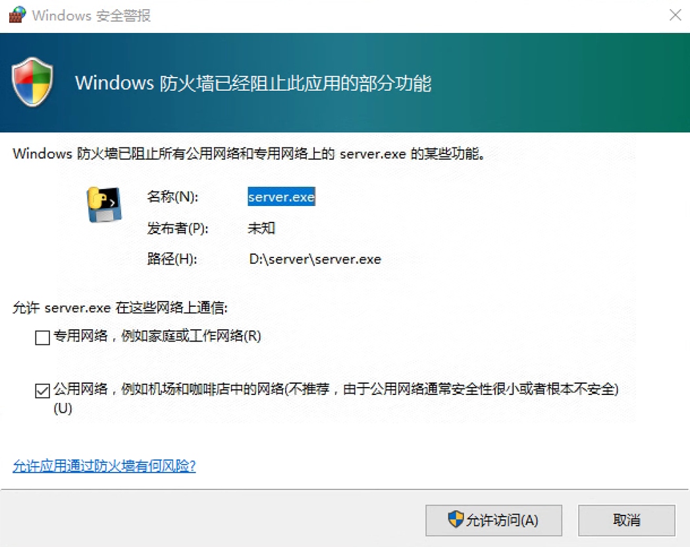

# MaiMaiPortableNFC

A wireless solution to transfer your custom NFC card to desktop.

> [!warning] This project is still under development

## To be implemented

## Usage Document

### Getting Started

1. Install the Client Application to your mobile.

2. Run Server program on your computer:

    - Method 1: If you have python environment
        - Run `pip install pyautogui` in terminal
        - Run `python server.py` in terminal
    - Method 2: If you have no python environment
        - Download the release of `server.zip` and unzip
        - Run `server.exe`

3. If there's firewall warning like the picture below, please **ALLOW**! 

4. If this is the first time you run `server.py`, the program will create `config.ini` in your dir. Please change the `aimeFilePath` to your own `aime.txt` path

    - Example: `[aimeFilePath]=D:\Package\DEVICE\aime.txt`

5. Restart `server.exe`

### Usage

1. Run `sever.exe` on computer, and the program will give you

    - Card binding records load information
    - `aime.txt` path information
    - IP information
    - Port information

2. Run `MaiMaiPortableNFC` on your mobile

3. Fill the IP and Port

4. Click `Connect`, and there'll be a congratulation if success.

5. If your NFC is oned and the application is listening, just hold your card near your phone to scan. If there's no record, the application will ask you to enter your `AccessCode`.

6. The computer will then successfully receive data.

## Support

Server: Windows 7+ (Python 3.11) (Tested on Windows 10)

Client: Android 5.0+ (Tested on Honor MagicOS 8.0 / Android 14)

## Roadmap

- [ ] iOS support